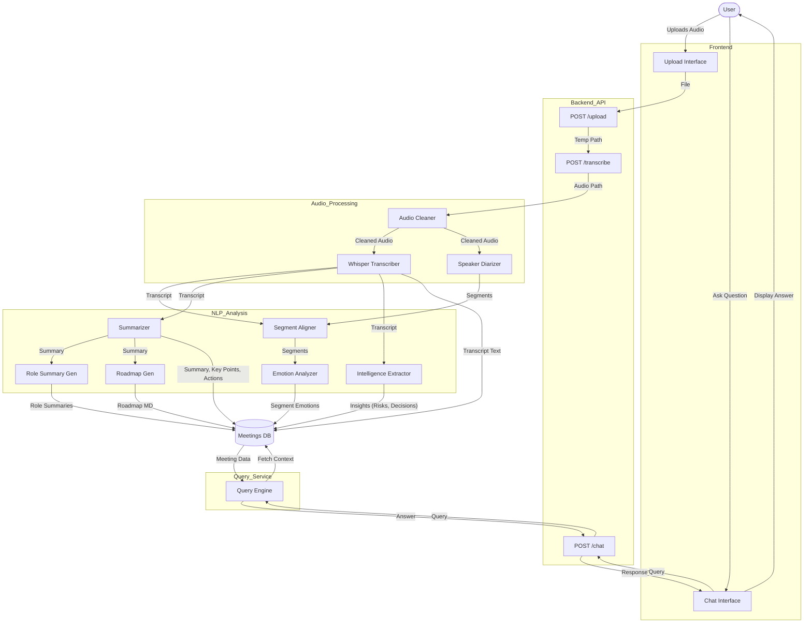

# Meeting Assistant System Architecture

## 1. High-Level Architecture Diagram
This diagram illustrates the main components of the Meeting Assistant system, demonstrating the interaction between the Client (Frontend), the Web Server (FastAPI), the Processing Services (AI Modules), and the Data Storage.

```mermaid
graph TD
    subgraph Client ["Frontend (React)"]
        UI[User Interface]
        Uploader[File Uploader]
        ChatUI[Chat Interface]
        Visualizer[Data Visualizer]
    end

    subgraph Server ["Backend (FastAPI)"]
        API[API Gateway / Router]
        WS[WebSocket Handler]
    end

    subgraph Processing ["Processing Core (Services)"]
        AudioProc[Audio Processing]
        subgraph AudioServices ["Audio Services"]
            Cleaner[Audio Cleaner]
            Whisper[Transcription (Whisper)]
            Diarization[Speaker Diarization]
        end
        
        NLPProc[NLP Engine]
        subgraph NLPServices ["NLP Services"]
            Aligner[Segment Aligner]
            Emotion[Emotion Analyzer]
            Summarizer[Summarizer (BART/LLM)]
            Insights[Intelligence Extractor]
            Roadmap[Roadmap Generator]
            QueryEng[Query Engine]
        end
    end

    subgraph Storage ["Data Layer"]
        SQLite[(SQLite Database)]
        FS[File System (Temp)]
    end

    %% Connections
    UI --> API
    Uploader --> API
    ChatUI --> API
    Visualizer --> API
    
    API --> AudioProc
    API --> NLPProc
    API --> SQLite
    
    WS -.-> UI
    
    AudioProc --> Cleaner
    Cleaner --> Whisper
    Cleaner --> Diarization
    
    NLPProc --> Aligner
    Aligner --> Emotion
    Whisper --> Summarizer
    Whisper --> Insights
    Summarizer --> Roadmap
    
    QueryEng --> SQLite
    
    classDef client fill:#e1f5fe,stroke:#01579b,stroke-width:2px;
    classDef server fill:#fff3e0,stroke:#ff6f00,stroke-width:2px;
    classDef process fill:#e8f5e9,stroke:#2e7d32,stroke-width:2px;
    classDef storage fill:#f3e5f5,stroke:#7b1fa2,stroke-width:2px;
    
    class Client,UI,Uploader,ChatUI,Visualizer client;
    class Server,API,WS server;
    class Processing,AudioProc,AudioServices,NLPProc,NLPServices,Cleaner,Whisper,Diarization,Aligner,Emotion,Summarizer,Insights,Roadmap,QueryEng process;
    class Storage,SQLite,FS storage;
```

## 2. Data Flow Diagram (DFD) - Level 1
This diagram details the flow of data through the system, specifically highlighting the "Meeting Processing Pipeline" and the "Chat/Query Pipeline".

### Process Flow:
1.  **Audio Upload**: User uploads an audio file.
2.  **Preprocessing**: Audio is cleaned (denoised).
3.  **Transcription & Diarization**: Audio is converted to text and speakers are identified.
4.  **Alignment**: Text segments are matched with speakers and analyzed for emotion.
5.  **Enrichment**:
    *   **Summarization**: Generates summary, key points, and action items.
    *   **Intelligence**: Extracts decisions, risks, and conflicts.
    *   **Roadmap**: Creates a markdown implementation plan.
6.  **Storage**: All generated data is stored in the database.
7.  **Query**: User asks a question, and the system retrieves answers from the stored knowledge.


